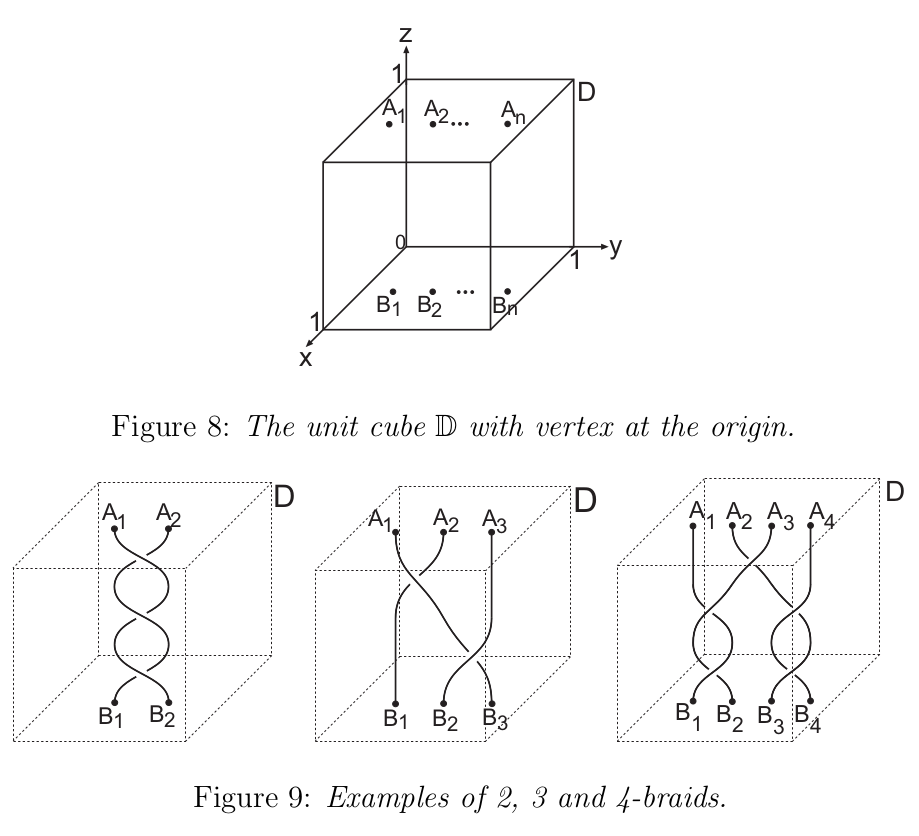

# An Introduction to Braid Theory
## Introduction
1. n-braid : (1) each strand starts on th top and ends on the bottom, (2) no two strands intersect, (3) traverse any strand from top, always moving downwards
2. n-braid $\beta$ is equivalent to n-braid $\beta'$: only 'shake the box'
3. multiply operation: joining the bottom of $\beta$ to the top of $\beta'$.
## Definitions
1. Braids:

$$A_i=(\frac{1}{2},\frac{i}{n+1},1)$$
$$B_i=(\frac{1}{2},\frac{i}{n+1},0)$$
2. ith braid string: $d_i$ starts from $A_i$ and some $B_k$.
3. $\mathcal{B}_n$: the set of all n-braids.
4. Elementary moves:
    - $\Omega$: replace edge AB in a braid string d by two edges $AC\cup BC$.
    - $\Omega^{-1}$; replace edges $AC\cup BC$ in d by AB.
5. $\beta$ is equivalent to $\beta'$, $\beta\sim\beta'$ $\Longleftrightarrow$ there exists a finite sequence of elementary moves that transform $\beta$ to $\beta'$.

* note: A trefoil knot is homeomorphic to a solid torus, but not isotopic in $\mathbb{R}^3$. Continuous mappings are not always realizable as deformations.

    * Homotopy: Homotopy is a coninuous function $H:X\times[0,1]\rightarrow Y$ such that $H(x,0)=f(x),\ H(x,1)=g(x)$. $f$ and $g$ are homotopic.
    * Homotopy equivalence: two topological spaces $X$ and $Y$ is homotopy equivalant if there exists $f:X\rightarrow Y$ and $g:Y\rightarrow X$ such that $g(f(x))$ is homotopic to $id_X$ and $f(g(y))$ is homotopic to $id_Y$. Intuitively, two spaces X and Y are homotopy equivalent if they can be transformed into one another by bending, shrinking and expanding operations.
    * Homeomorphism: two topological spaces is a homeomorphism if there is a function between them and is (1) bijection, (2) continuous, (3) inversion function is continuous. Homeomorphism is a special case of homotopy equivalence, where $g(f(x)) = id_X$ and $f(g(y)) = id_Y$ or says $g=f^{-1}$.
    * Isotopy, ambient isotopy, strong isotopic: requirel advanced knowledge of topology.

6. Regular projection of braid: ploy to yz plane and any intersection point is a double point.
7. Regular diagram of braid: remove a small section of the lower braid at intersection points.

## The Braid Group
1. braid product: joining the bottom of $\beta_1$ to the top of $\beta_2$.
    * $\beta_1,\beta_2\in\mathcal{B}_n\Longrightarrow\beta_1\beta_2\in\mathcal{B}_n$
    * $\beta_1,\beta_1',\beta_2,\beta_2'$ and $\beta_1\sim\beta_1',\beta_2\sim\beta_2'\Longrightarrow\beta_1\beta_2\sim\beta_1'\beta_2'$
    * $\beta_1,\beta_2,\beta_3\in\mathcal{B}_n\Longrightarrow(\beta_1\beta_2)\beta_3\sim\beta_1(\beta_2\beta_3)$
2. identity or trivial braid: join $A_i$ to $B_i$, denoted $1_n$
    * $\beta1_n\sim1_n\beta\sim\beta$
    * $\forall\beta\in\mathcal{B}_n,\exist\beta'\in\mathcal{B}_n,\beta\beta'\sim1_n$, called the inverse of $\beta$, denoted by $\beta^{-1}$. It is easy to construct the inverse of a n-braid: create a new braid by relecting in the bottom face.
3. define $[\beta]=\{\beta'\in\mathcal{B}_n|\beta'\sim\beta\}$.
    * $[\beta][\beta']:=[\beta\beta']$
4. n-braid group: $\mathbf{B}_n:=\mathcal{B}_n/\sim$ with multiply operation.
    * any two braids in the n-braid group is not equivalent to each other (braids in n-braid group are unique)
    * Group definition: (1) closed: $[\beta_1][\beta_2]=[\beta_1\beta_2]\in\mathbf{B}_n$;
    (2) multiply is an associative operation: $([\beta_1[]\beta_2])[\beta_3]\sim[\beta_1]([\beta_2][\beta_3])$;
    (3) has identity element: $[1_n]$;
    (4) has inverse: $[\beta_1]^{-1}:=[\beta_1^{-1}]$
5. Any braid in n-braid group can be written as the product of Artin generators: $\beta=\sigma_{i_1}^{\epsilon_1}\dots\sigma_{i_k}^{\epsilon_k}$, $1\leq i_1,\dots,i_k\leq n-1,\epsilon_i\in\{-1,1\}$.
    * note: move the intersection points to different levels and separate them to obtain artin components.
    * Artin generators for $\mathbf{B}_n$: $\{\sigma_1,\dots,\sigma_{n-1}\}$, where $\sigma_i$ is the braid with only one crossing: $A_iB_{i+1}$ crosses under $A_{i+1}B_i$.
6. Theorems:
    * $\forall |i-j|\geq2\Longrightarrow\sigma_i\sigma_j=\sigma_j\sigma_i$. note: the artin components can exchange if they are not tangled.
    * $\sigma_i\sigma_{i+1}\sigma_i=\sigma_{i+1}\sigma_i\sigma_{i+1}$
7. presentation of a group: A presentation of a group G comprises a set S of generators and a set R of relations among those generators. We then say G has presentation $\langle S\mid R\rangle$.
    * Presentation of the n-braid group:
    $$\mathbf{B}_n = \langle\sigma_1.\dots,\sigma_{n-1}|\sigma_i\sigma_j=\sigma_j\sigma_i,|i-j|\geq2,\\ \sigma_i\sigma_{i+1}\sigma_i=\sigma_{i+1}\sigma_i\sigma_{i+1}, 1\leq i\leq n-2\rangle$$

## Properties of the braid group
1. braid permutation: $\pi:\mathbf{B}_n\rightarrow\mathbf{S}_n$ where $S_n$ is the symmetric group on n elements, by
$$\pi(\beta):=\left(\begin{array}{cc}1 & 2 & \cdots & n\\
    j(1) & j(2) & \cdots & j(n)\end{array}\right)$$
2. braid invariant: $f:\mathcal{B}_n\rightarrow X$ is a braid invariant if $\beta\sim\beta'\Rightarrow f(\beta)=f(\beta')$
note: two braid with the same invariants are not neccessary equavalent.
3. Let $\delta_n:\mathcal{B}_n\rightarrow\mathbf{B}_n$ ($\delta(\beta)=[\beta]$). $\pi(\delta(\beta))$ is a braid invariant.
4. exponent sum $exp:\mathbf{B}_n\rightarrow\mathbb{Z}$
$$exp(\beta)=exp(\sigma_{i_1}^{\epsilon_1}\cdots\sigma_{i_k}^{\epsilon_k}):=\epsilon_1+\cdots+\epsilon_k$$
5. $exp(\delta(\beta))$ is a braid invariant.
6. pure braid: each braid string $d_i$ starts at $A_i$ and ends at $B_i$, denoted by $\mathbf{P}_n:=\{\beta\in\mathbf{B}_n|\pi(\beta)=(1)\}=Ker(\pi)$
7. the pure braid group has a presentation with 
    * generators: $A_{j,k}=\sigma_{k-1}\sigma_{k-2}\cdots\sigma_{j+1}\sigma_j^2\sigma_{j+1}\sigma_{k-2}\sigma_{k-1}$, $1\leq j<k\leq n$
    * relators:
        * $[A_{r,s}A_{i,j}]=1$, $1\leq r<s<i<j\leq n$ or $1\leq r<i<j<s\leq n$
        * $A_{r,s}A_{r,j}A^{−1}_{r,s} = A^{−1}_{s,j}A_{r,j}A_{s,j}$ if $1 \leq r < s < j \leq n$
        * $A_{r,s}A_{s,j}A^{−1}_{r,s} = A^{−1}_{s,j}A^{−1}_{r,j}A_{s,j}A_{r,j}A_{s,j}$ if $1 \leq r < s < j \leq n$
        * $[A^{−1}_{i,j}A_{s,j}A_{i,j}A_{r,i}]$ if $1 \leq r < s < i < j \leq n$

8. 

