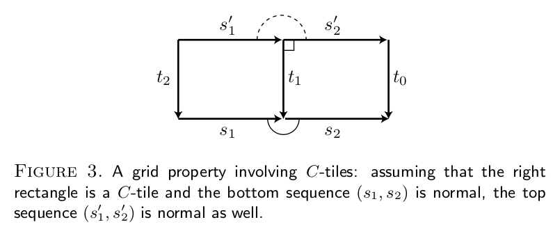
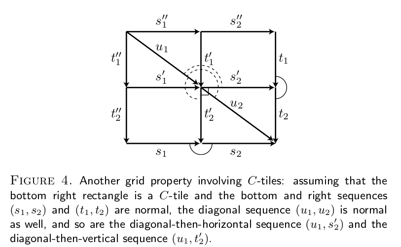
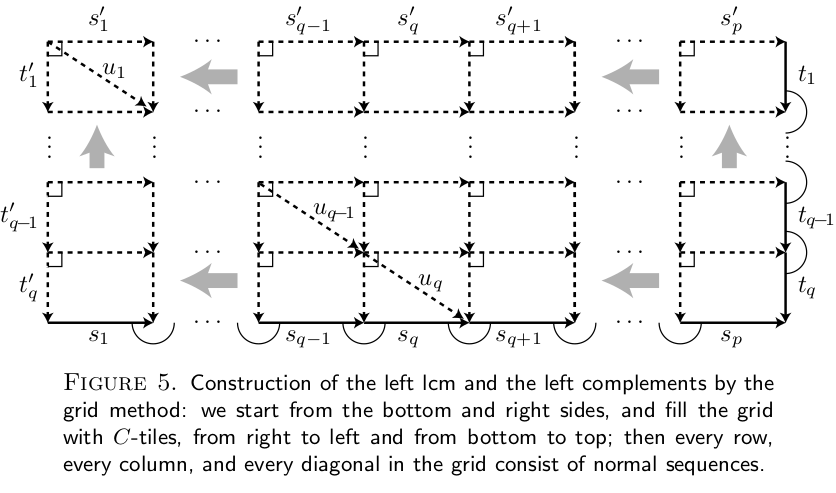
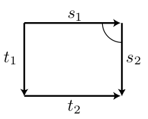
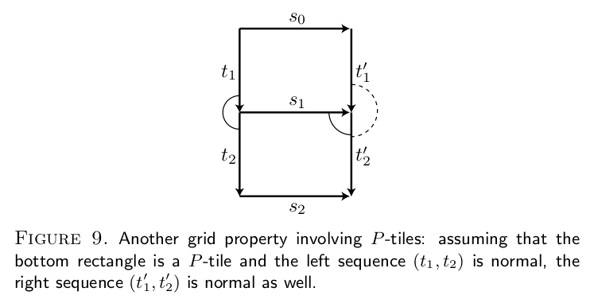
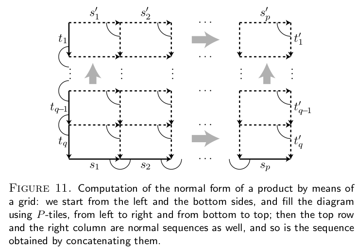

# An Introduction to Braid Theory
## Introduction
1. n-braid : (1) each strand starts on th top and ends on the bottom, (2) no two strands intersect, (3) traverse any strand from top, always moving downwards
2. n-braid $\beta$ is equivalent to n-braid $\beta'$: only 'shake the box'
3. multiply operation: joining the bottom of $\beta$ to the top of $\beta'$.
## Definitions
1. Braids:

$$A_i=(\frac{1}{2},\frac{i}{n+1},1)$$
$$B_i=(\frac{1}{2},\frac{i}{n+1},0)$$
2. ith braid string: $d_i$ starts from $A_i$ and some $B_k$.
3. $\mathcal{B}_n$: the set of all n-braids.
4. Elementary moves:
    - $\Omega$: replace edge AB in a braid string d by two edges $AC\cup BC$.
    - $\Omega^{-1}$; replace edges $AC\cup BC$ in d by AB.
5. $\beta$ is equivalent to $\beta'$, $\beta\sim\beta'$ $\Longleftrightarrow$ there exists a finite sequence of elementary moves that transform $\beta$ to $\beta'$.

* note: A trefoil knot is homeomorphic to a solid torus, but not isotopic in $\mathbb{R}^3$. Continuous mappings are not always realizable as deformations.

    * Homotopy: Homotopy is a coninuous function $H:X\times[0,1]\rightarrow Y$ such that $H(x,0)=f(x),\ H(x,1)=g(x)$. $f$ and $g$ are homotopic.
    * Homotopy equivalence: two topological spaces $X$ and $Y$ is homotopy equivalant if there exists $f:X\rightarrow Y$ and $g:Y\rightarrow X$ such that $g(f(x))$ is homotopic to $id_X$ and $f(g(y))$ is homotopic to $id_Y$. Intuitively, two spaces X and Y are homotopy equivalent if they can be transformed into one another by bending, shrinking and expanding operations.
    * Homeomorphism: two topological spaces is a homeomorphism if there is a function between them and is (1) bijection, (2) continuous, (3) inversion function is continuous. Homeomorphism is a special case of homotopy equivalence, where $g(f(x)) = id_X$ and $f(g(y)) = id_Y$ or says $g=f^{-1}$.
    * Isotopy, ambient isotopy, strong isotopic: requirel advanced knowledge of topology.

6. Regular projection of braid: ploy to yz plane and any intersection point is a double point.
7. Regular diagram of braid: remove a small section of the lower braid at intersection points.

## The Braid Group
1. braid product: joining the bottom of $\beta_1$ to the top of $\beta_2$.
    * $\beta_1,\beta_2\in\mathcal{B}_n\Longrightarrow\beta_1\beta_2\in\mathcal{B}_n$
    * $\beta_1,\beta_1',\beta_2,\beta_2'$ and $\beta_1\sim\beta_1',\beta_2\sim\beta_2'\Longrightarrow\beta_1\beta_2\sim\beta_1'\beta_2'$
    * $\beta_1,\beta_2,\beta_3\in\mathcal{B}_n\Longrightarrow(\beta_1\beta_2)\beta_3\sim\beta_1(\beta_2\beta_3)$
2. identity or trivial braid: join $A_i$ to $B_i$, denoted $1_n$
    * $\beta1_n\sim1_n\beta\sim\beta$
    * $\forall\beta\in\mathcal{B}_n,\exist\beta'\in\mathcal{B}_n,\beta\beta'\sim1_n$, called the inverse of $\beta$, denoted by $\beta^{-1}$. It is easy to construct the inverse of a n-braid: create a new braid by relecting in the bottom face.
3. define $[\beta]=\{\beta'\in\mathcal{B}_n|\beta'\sim\beta\}$.
    * $[\beta][\beta']:=[\beta\beta']$
4. n-braid group: $\mathbf{B}_n:=\mathcal{B}_n/\sim$ with multiply operation.
    * any two braids in the n-braid group is not equivalent to each other (braids in n-braid group are unique)
    * Group definition: (1) closed: $[\beta_1][\beta_2]=[\beta_1\beta_2]\in\mathbf{B}_n$;
    (2) multiply is an associative operation: $([\beta_1][\beta_2])[\beta_3]\sim[\beta_1]([\beta_2][\beta_3])$;
    (3) has identity element: $[1_n]$;
    (4) has inverse: $[\beta_1]^{-1}:=[\beta_1^{-1}]$
5. Any braid in n-braid group can be written as the product of Artin generators: $\beta=\sigma_{i_1}^{\epsilon_1}\dots\sigma_{i_k}^{\epsilon_k}$, $1\leq i_1,\dots,i_k\leq n-1,\epsilon_i\in\{-1,1\}$.
    * note: move the intersection points to different levels and separate them to obtain artin components.
    * Artin generators for $\mathbf{B}_n$: $\{\sigma_1,\dots,\sigma_{n-1}\}$, where $\sigma_i$ is the braid with only one crossing: $A_iB_{i+1}$ crosses under $A_{i+1}B_i$.
6. Theorems:
    * $\forall |i-j|\geq2\Longrightarrow\sigma_i\sigma_j=\sigma_j\sigma_i$ or $\sigma_i^{-1}\sigma_j=\sigma_j\sigma_i^{-1}$ or $\sigma_i\sigma_j^{-1}=\sigma_j^{-1}\sigma_i$. note: the artin components can exchange if they are not tangled.
    * $\sigma_i\sigma_{i+1}\sigma_i=\sigma_{i+1}\sigma_i\sigma_{i+1}$
    * $\sigma_i^{-1}\sigma_{i+1}\sigma_i=\sigma_{i+1}\sigma_i\sigma_{i+1}^{-1}$
    * $\sigma_i\sigma_{i+1}\sigma_i^{-1}=\sigma_{i+1}^{-1}\sigma_i\sigma_{i+1}$
7. presentation of a group: A presentation of a group G comprises a set S of generators and a set R of relations among those generators. We then say G has presentation $\langle S\mid R\rangle$.
    * Presentation of the n-braid group:
    $$\mathbf{B}_n = \langle\sigma_1.\dots,\sigma_{n-1}|\sigma_i\sigma_j=\sigma_j\sigma_i,|i-j|\geq2,\\ \sigma_i\sigma_{i+1}\sigma_i=\sigma_{i+1}\sigma_i\sigma_{i+1}, 1\leq i\leq n-2\rangle$$

## Properties of the braid group
1. braid permutation: $\pi:\mathbf{B}_n\rightarrow\mathbf{S}_n$ where $S_n$ is the symmetric group on n elements, by
$$\pi(\beta):=\left(\begin{array}{cc}1 & 2 & \cdots & n\\
    j(1) & j(2) & \cdots & j(n)\end{array}\right)$$
2. braid invariant: $f:\mathcal{B}_n\rightarrow X$ is a braid invariant if $\beta\sim\beta'\Rightarrow f(\beta)=f(\beta')$
note: two braid with the same invariants are not neccessary equavalent.
3. Let $\delta_n:\mathcal{B}_n\rightarrow\mathbf{B}_n$ ($\delta(\beta)=[\beta]$). $\pi(\delta(\beta))$ is a braid invariant.
4. exponent sum $exp:\mathbf{B}_n\rightarrow\mathbb{Z}$
$$exp(\beta)=exp(\sigma_{i_1}^{\epsilon_1}\cdots\sigma_{i_k}^{\epsilon_k}):=\epsilon_1+\cdots+\epsilon_k$$
5. $exp(\delta(\beta))$ is a braid invariant.
6. pure braid: each braid string $d_i$ starts at $A_i$ and ends at $B_i$, denoted by $\mathbf{P}_n:=\{\beta\in\mathbf{B}_n|\pi(\beta)=(1)\}=Ker(\pi)$
7. the pure braid group has a presentation with
    * generators: $A_{j,k}=\sigma_{k-1}\sigma_{k-2}\cdots\sigma_{j+1}\sigma_j^2\sigma_{j+1}\sigma_{k-2}\sigma_{k-1}$, $1\leq j<k\leq n$
    * relators:
        * $[A_{r,s}A_{i,j}]=1$, $1\leq r<s<i<j\leq n$ or $1\leq r<i<j<s\leq n$
        * $A_{r,s}A_{r,j}A^{−1}_{r,s} = A^{−1}_{s,j}A_{r,j}A_{s,j}$ if $1 \leq r < s < j \leq n$
        * $A_{r,s}A_{s,j}A^{−1}_{r,s} = A^{−1}_{s,j}A^{−1}_{r,j}A_{s,j}A_{r,j}A_{s,j}$ if $1 \leq r < s < j \leq n$
        * $[A^{−1}_{i,j}A_{s,j}A_{i,j}A_{r,i}]$ if $1 \leq r < s < i < j \leq n$

## The word problem
1. Word: a word is a way to describe the braid in terms of basic operations that construct the braid. For example, $w=\sigma_1\sigma_2\sigma_1^{-1}$.
2. positive braid: $\mathbf{B}_n^+:=\{\beta\in\mathbf{B}_n|\beta=\sigma_{i_1}\cdots\sigma_{i_k},1\leq i_j\leq n-1,k\in\mathbb{N}\}$. The positive braid consists of all positive word.
3. Theorem: If two positive n-braids are equivalent, then when written as positive word they are of the same length.
Since $\beta,\beta'$ are positive braids, the length of their words equals to the exponent sum:
$$\beta\sim\beta',\ \beta,\beta'\in\mathcal{B}_n\Longleftrightarrow
exp(\beta)=exp(\beta')$$
4. The Garside braid $\Delta_n\in\mathbf{B}_n$ by
$\Delta_n:=(\sigma_1\sigma_2\cdots\sigma_{n-1})(\sigma_1\sigma_2\cdots\sigma_{n-2})\cdots(\sigma_1\sigma_2)(\sigma_1)=\Pi_{n-1}\Pi_{n-2}\cdots\Pi_2\Pi_1$. Here is some properties:
    * $\forall i,r, 1<i\leq r\leq n-1, \sigma_i\Pi_r=\Pi_r\sigma_{i-1}$
    * $\forall 1\leq t\leq n-1, \sigma_1(\Pi_t\Pi_{t-1}\Pi_1)=(\Pi_t\Pi_{t-1}\Pi_1)\sigma_t$. Especially, $\sigma_1\Delta_n=\Delta_n\sigma_{n-1}$.
    * $\sigma_i\Delta_n=\Delta_n\sigma_{n-i}$
5. Using the properties, we have theorems:
    * $\sigma_i\Delta_n^2=\Delta_n^2\sigma_i$. The square of the Garside braid is in the centre of $\mathbf{B}_n$
    * The inner automorphism defined by $\tau(\beta)=\Delta_n^{-1}\beta\Delta_n$ sends $\sigma_i$ to $\sigma_{n-i}$, which means $\tau(\sigma_i)=\sigma_{n-i}$.
6. reverse of a word: $w=\sigma_{i_1}^{\epsilon_1}\cdots\sigma_{i_k}^{\epsilon_k}$ and its reverse $rev(w)=\sigma_{i_k}^{\epsilon_k}\cdots\sigma_{i_1}^{\epsilon_1}$
    * $rev(w_1w_2)=rev(w_2)rev(w_1)$
    * $rev(\Pi_r\cdots\Pi_1)=\Pi_r\cdots\Pi_1$
    * $rev(\Delta_n)=\Delta_n$

# Ordering Braids
## Braid Groups
### The Artin presentation
1. Braid relations: $B_n$ is the *n-strand braid group* presented by Artin generators $\sigma_1,\dots,\sigma_{n-1}$.
    - note: $B_n$ is a subgroup of $B_\infty$
2. Braid words:
    - *n-strand braid word*: a word on the letters $\sigma_1^{\pm1},\dots,\sigma_{n-1}^{\pm1}$.
    - length of a braid word $w$: $l(w)$
    - the braid word $w$ represents $\beta$: $\beta=\overline{w}$

### Isotopy classes of braid diagrams
1. Geometric braids

    - note: the disk $D^2$ can be replaced by any compact surface $\cal{S}$ with boundary. Choosing n puncture points in $\cal{S}$, the *n-strand braid groups* can be defined in $\cal{S}\times[0,1]$.
    - The idea is simply to look at braids from one end rather than from the side.
2. $B_n$ is the group of isotopy classes of n-strand geometric braids.
### Mapping class groups
1. homeomorphisms of a surface
    - $\cal{S}$: an oriented compact surface
    - $\cal{P}$: a finite set of distinguished interior points of $\cal{S}$
    - $\cal{MCG}(\cal{S},\cal{P})$: *the mapping class group*.
    - convention: the product on $\cal{MCG}$ is composition: e.g. $\varphi\phi$ means "first $\varphi$, then $\phi$".
2. Curve diagrams

### Positive braids
1. Braid monoids:
    - positive word: words in the letters $\sigma_i$ but not $\sigma_i^{-1}$.
    - positive braid: the elements of $B_n^+$ are represented by positive words.
    - $B_n^+$ is a monoid
2. The canonical mapping of $B^+_n$ to $B_n$ is injective.
    - understand: You can uniquely identify a positive braid in the context of all possible braids. No two different positive braids will be considered the same when looking at them within the broader group of all braids.
3. Fundamental braids $\delta_n$ and $\Delta_n$
    - $\delta_n = \sigma_1\dots\sigma_{n-1}$
    - $\Delta_n = \delta_n\dots\delta_2$ (Garside braid)
    - relations
        - $\delta_n\sigma_i=\sigma_{i+1}\delta_n$
        - $\Delta_n\sigma_i=\sigma_{n-i}\Delta_n$
        - $\delta_n\delta_n\delta_n\delta_n=\Delta_n\Delta_n$
    - cycling automorphism $\phi_n:\beta\rightarrow\delta_n\beta\delta^{-1}_n$
    - flip automorphism $\Phi_n:\beta\rightarrow\Delta_n\beta\Delta^{-1}_n$
    - relations
        - $\phi_n(\sigma_i)=\sigma_{i+1},i\leq n-2$
        - $\Phi_n(\sigma_i)=\sigma_{n-i},i\leq n-1$

4. Fractionary decompositions
    - Every braid is a quotient of two positive braids.
    - Consider decompositions in which he denominator is a power of the Garside braid $\Delta_n$:
        - Every braid $\beta$ admits a decomposition $\beta=\Delta_n^{-2p}\beta'$.
        - Let $w$ is the word of $\beta$. $p$ is the number of negative letters in $w$
        - Let $\beta'$ be the braid from $\beta$ by replacing $\sigma_i^{-1}$ with $\sigma_i^{-1}\Delta_n^2\Longrightarrow \beta'=\Delta_n^{2p}\beta$
        - Lemma: $\forall i \leq n-1$, $\Delta_n$ can be expressed by a positive word that begins with $\sigma_i$
        - $\beta'$ is positive.
5. The poset $(B^+_n,\preceq)$ is a **lattice**
    - **lattice** in math: lattice is a set which satisfies that any pair of elements has a least upper bound and a greatest lower bound. For example, a set with the operations of union and intersection.
    - **GCD (greatest common left divisor) of x and y**: $\exist z\in B^+_n,s.t. x= zx',y=zy'$. $gcd_L(x,y):=z$.
    - **LCM (least common right multiple) of x and y**: $\exist z\in B^+_n, s.t. z=xx'=yy'$ and $gcd_L(x',y')=1$. $lcm_R(x,y):=z$.

## Linear Ordering of Braids (Dehornoy ordering)
### The $\sigma$-ordering of $B_n$
1. A group is orderable if there exist a strict ordering.
    - strict ordering $\prec$ of a set: (1) antireflexive. $x\prec x$ never hold. (2) transitive. $x\prec y, y\prec, z\Rightarrow x\prec z$.
2. Definition.
    - Left-ordering or Left-invariant ordering. $x\prec y\Rightarrow zx\prec zy$.
    - Bi-ordering or bi-invariant ordering. The group is both left-orderable and right-orderable.
3. The $\sigma$-ordering of braids
    - A word $w$ is *$\sigma$-positive* (*$\sigma$-negative*) if $\sigma_i$ with lowest index occurs only positively (negatively). e.g. $\sigma_3\sigma_2\sigma^{-1}_3$ is *$\sigma$-positive*.
    - A word $w$ is $\sigma_i$-positive if it has at least one $\sigma_i$ but no $\sigma_i^{-1}$ and no $\sigma^{\pm1}_j,j<i$.
    - A word $w$ is $\sigma_i$-free if it doesn't has $\sigma^{\pm1}_j,j\leq i$.
4. Define $<_n$: $\forall \beta,\beta'\in B_n$, if $\beta^{-1}\beta'$ has a word that is $\sigma$-positive, then $\beta<_n\beta'$.
    - e.g. $\beta=\sigma_2$ and $\beta'=\sigma_3\sigma_2$. Since $\sigma_2^{-1}\sigma_3\sigma_2=\sigma_3\sigma_2\sigma_3^{-1}$, $\beta<_4\beta'$
    - Since $\sigma_{i+1}^{-1}\sigma_i$ is $\sigma$-positive, we have: $\sigma_\infty<_\infty\cdots<_\infty\sigma_2<_\infty\sigma_1$.
5. $<_n$ is a left-invariant ordering of $B_n$.
    - $B_n$ cannot be bi-invariant orderable.
6. The $\sigma^\Phi$-ordering of braids
    - Define $<_n^\Phi$: $\forall \beta,\beta'\in B_n$, if $\Phi(\beta)<_n^\Phi\Phi(\beta')$, then $\beta<_n^\Phi \beta'$.
    - A word $w$ is $\sigma^\Phi$-positive if $\sigma_i$ with highest index occurs only positively
7. Define $<_n^\Phi$: $\forall \beta,\beta'\in B_n$, if $\beta^{-1}\beta'$ has a word that is $\sigma^\Phi$-positive, then $\beta<_n^\Phi\beta'$.
    - $1<^\Phi\sigma_1<^\Phi\sigma_2<^\Phi\cdots$.

8. **Property**
    - A. A $\sigma$-positive braid word is not trivial.
    - C. Every nontrivial braid of $B_n$ admits an n-strand representative word that is $\sigma$-positive or $\sigma$-negative.
    - S. Every braid of the form $β^{−1}σ_iβ$ is $σ$-positive.
    - A (second form). A $σ_1$ -positive braid word is not trivial.
    - C (second form) Every braid of $B_n$ admits an n-strand representative word that is $σ_1$ -positive, $σ_1$-negative, or $σ_1$-free.

# EFFICIENT SOLUTIONS TO THE BRAID ISOTOPY PROBLEM
### The greedy normal form
0. $B_n^+$ contains braids that can be represented by one positive word. A positive word contains no letter $\sigma_i^{-1}$.
    - Any two positive n-braids $x,y$ admit a greatest common left divisor $gcd_L(x,y)$ and a least common right multiple.
1. Left divisor. $\forall x,y,z\in B_n^{+}$, $y=xz$, then $x\prec_L y$ and x is a left divisor of y, y is a right multiple of x.
    - right divisor. $\forall x,y,z\in B_n^{+}$, $y=zx$, then $x\prec_R y$ and x is a right divisor of y, y is a left multiple of x.
    - note: the definition is the same as that in previous section.
2. Simple braids. The left and right divisors of Garside braid $\Delta_n$ are coincide.
    - For example, $\Delta_n=\delta_n\Delta_{n-1}$, then $\delta_n$ is a left divisor and $\Delta_{n-1}$ is a right divisor of $\Delta_n$.
    - The simple braids form a finite sublattics of $B^+_n$ with $n!$ elements.
3. A sequence of simple braids $(s_1,\dots,s_p)$ is *normal*, if $\forall k < p$ and $\forall \sigma_i$ is a left divisor of $s_{k+1}$, then $\sigma_i$ is a right divisor of $s_k$.
4. A sequence of permutations $(f_1,\dots,f_p)$ is *normal*, if $\forall k<P$ and $f^{-1}_{k+1}(i)>f^{-1}_{k+1}(i+1)$, then $f_k(i)>f_k(i+1)$.
    - note: to understand the relation between 3 and 4, we need to find the meanings of left or right divisor in permutation.
        - Lemma. $\sigma_i$ is a right divisor $\Longleftrightarrow$ $f_k(i)>f_k(i+1)$. The proof is intuitive, because there is no $\sigma_i^{-1}$.
        - The right divisor of $\beta$ is the left divisor of $\beta^{-1}$.

5. Theorem.
    - Every braid $z\in B_n$ can be written as $z=\Delta_n^ms_1s_2\dots s_p$ and $(s_1,\dots,s_p)$ is a normal sequence, satisfying $s_1\neq\Delta_n,s_p\neq1$.
    - Every braid $z\in B_n$ can be written as $z=\Delta_n^m\overline{f_1}\dots\overline{f_p}$ and $(f_1,\dots,f_p)$ is a normal sequence, satisfying $f_1\neq w_n,f_p\neq id$.
    - *The greed normal form of braid*: $(m;s_1,\dots,s_p)$ or $(m;f_1,\dots,f_p)$
    - for example, $(0;\empty)$ is the greedy normal form of $1$.
    - note: the greedy normal forms is unique. Which means: (1) A braid can only have one greedy normal form. (2) If the greedy normal forms of two braids are different, then the braids are different.
6. Explanation.
    - In the greedy normal form $\Delta_n^ms_1\dots s_p:=\Delta_n^m x$, $x\in B_n^+$ and $\Delta_n\npreceq_L x$.
        - proof. If $\Delta_n\preceq x$, then we can always have $x=\Delta_n x'$ because $\Delta_n\sigma_i=\sigma_{n-i}\Delta_n$. And there will be two greedy normal forms $\Delta_n^mx=\Delta_n^{m+1}x'$, which contracdicts uniqueness.
    - $\forall x\in B_n^+$, there exists a unique normal sequnce $(s_1,\dots,s_p)$ of simple n-braids with $s_p\neq1$ satisfying $x=s_1\dots s_p$.
    - $gcd_L(x,y)=1\Longleftrightarrow gcd_L(s_1,t_1)=1$.

### The symmetric normal form
1. Theorem.
    - Every braid $z\in B_n$ can be written as $z=t^{-1}_q\dots t^{-1}_1s_1s_2\dots s_p$ and $(t_1,\dots,t_q), (s_1,\dots,s_p)$ are a normal sequences, satisfying $t_1\neq1,s_p\neq1$ and $gcd_L(s_1,t_1)=1$.
    - Every braid $z\in B_n$ can be written as $z=\overline{g_1}^{-1}\dots\overline{g_q}^{-1}\overline{f_1}\dots\overline{f_p}$ and $(f_1,\dots,f_p), (g_1,\dots,g_q)$ are a normal sequences, satisfying $f_1^{-1}(i)>f_1^{-1}(i+1) \Rightarrow g_1^{-1}(i)\leq g_1^{-1}(i+1)$.
    - for example, $(\empty;\empty)$ is the symmetric normal form of $1$.
    - note: the greedy normal forms is unique.

### Grid Properties of the Normal Form
1. Problem statement: $\forall x,y\in B_n^+$, (1) find the greedy normal form of $yx$; (2) assuming that y is a right divisor of x ($x=zy$), find the greedy normal form of $xy^{-1}$.
2. Lemma 1. $\forall z\in B^+_n$, define $\alpha(z):=gcd_L(z,\Delta_n)$. $\forall x,y\in B_n$:
    - $\alpha(x)\preceq_L x$, and $\alpha(x) = x$ if x is simple.
    - $x\preceq_L y \Longleftrightarrow \alpha(x)\preceq_L \alpha(y)$
    - $\alpha(xy) = \alpha(x\alpha(y))$
3. Lemma 2. a sequence of simple braid $(s_1,\dots,s_p)$ is normal $\Longleftrightarrow s_k=\alpha(s_ks_{k+1})$.
    - Lemma 2.1. Any divisor of $\Delta_n$ do not contain $\sigma_i^2$ in the word. Therefore, if $s_k\neq\alpha(s_ks_{k+1})$, then there will be $\sigma_i^2$ in $\alpha(s_ks_{k+1})$, which will not be a left divisor of $\Delta_n$.
4. Definition. $\forall x,y \in B^+_n$, there is a unique $x'\in b^+_n$ satisfying $lcm_L(x,y)=x'y$. $x'$ is called the left complement of x in y and denoted by $x/y$.
    - Let $z:=lcm_L(x,y)$. Then, $\exist a,b\in B_n^+, z=ax,z=by$.
    - If y is a right divisor of x, then $lcm_L(x,y)=x\Longleftrightarrow y/x\cdot x = x, x/y\cdot y = x \Longleftrightarrow y/x = 1,x/y=xy^{-1}$.
    - intuitively, $x/y$ means what is left in $x$ after removed the greatest common right divisor of $x$ and $y$.
5. *C-tile*: four simple braids $s,t,s',t'$ satisfying $s't=t's$ and $gcd_L(s',t')=1$.
6. Lemma 3. Simple braids $s_1,s_2,s_1',s_2',t_0,t_1,t_2$. We have $t_2s_1=s_1't_1, t_1s_2=s_2't_0, gcd_L(s_2',t_1)=1$ and $(s_1,s_2)$ is normal. Then $(s_1',s_2')$ is normal as well.

7. Lemma 4. $(s_1,s_2)$ and $(t_1,t_2)$ are normal sequences of simple braids, $gcd_L(s_2',t_2')=1$ $\implies$ $(u_1,u_2)$, $(u_1,s_2')$, and $(u_1,t_2')$ are normal.

8. **Construction of the left lcm and the left complements by grid method.**

    - known: $x=s_1\cdots s_p,y=t_1\cdots t_q, p\geq q$
    - $lcm_L(x,y)=u_1\cdots u_qs_{q+1}\cdots s_p$
    - $x/y=s'_1\cdots s'_p, y/x=t'_1\cdots t'_q$
9. Define *P-tile*. Four simple braids $s_1,s_2,t_1,t_2$ satisfying $s_1s_2=t_1t_2$ and $(s_1,s_2)$ is normal. THe diagram made from these four braids is called *P-tile*.

    
10. Lemma 5. Simple braids $s_1,s_2,s_1',s_2',t_0,t_1,t_2$ satisfying $t_0s_1=s_1't_1,t_1s_2=s_2't_2$ and $(s_1,s_2),(s_1',t_1)$ are normal. Then, $(s_1',s_2')$ is normal.

    

11. Lemma 6. Simple braids $s,t$. $(s,t)$ is normal $\Longleftrightarrow$ $gcd_L(s^*,t)=1$, where $ss^*=\Delta_n$.
    - proof. From lemma 2, $(s,t)$ is normal $\Longleftrightarrow\ \alpha(st)=s$. $\because\ gcd_L(s^*,t)=1\ \therefore\ \alpha(st)=gcd_L(st,\Delta_n)=gcd_L(st,ss^*)=s\cdot gcd_L(t,s^*)=s$
12. Lemma 7. Simple braids $s_0,s_1,s_2,t_1,t_2,t_1',t_2'$ satisfying $t_1s_1=s_0t_1',t_2s_2=s_1t_2'$ and $(t_1,t_2),(s_1,t_2')$ are normal. Then, $(t_1',t_2')$ is normal.

    

13. Construction of the product by grid method.
    
    - known: $x=s_1\cdots s_p,y=t_1\cdots t_q$
    - $yx=s'_1\cdots s'_pt'_1\cdots t'_q$

14. **Computing the greedy normal form**.